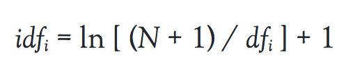
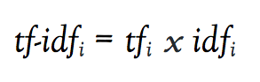

# Processing, Exploring, and Analyzing a Document Corpus with TF-IDF

## Preparation

### Suggested Prior Skills

- Advanced beginner familiarity with Python or a similar programming language. The precise level of code literacy or familiarity recommended is hard to estimate, but you will want to be comfortable with basic types and operations. Code for this lesson is written in Python 3.6, but TF-IDF is available in many versions of Python and other programming languages. To get the most out of this lesson, it is recommended that you work your way through something like Codeacademy's Introduction to Python course, or that you complete some of the introductory Python lessons on _The Programming Historian_. 
- In lieu of the above recommendation, you should review Pythons basic types (string, integer, float, list, tuple, dictionary), working with variables, writing loops in Python, and working with object classes/instances.
- Familiarity with Excel or an equivalent spreadsheet application if you wish to examine the linked spreadsheet files.

### Before You Begin

- Install the Python 3 version of Anaconda. Installing Anaconda is covered in [Text Mining in Python through the HTRC Feature Reader](https://programminghistorian.org/en/lessons/text-mining-with-extracted-features). This will install Python 3.6 (or higher), the scikit-learn library (which we will use for TF-IDF), and the dependencies needed to run a Jupyter Notebook.   
- It is possible to install all these dependencies without Anaconda (or with a lightweight alternative like Miniconda). For more information, see the section below titled ["Alternatives to Anaconda"](#alternatives-to-anaconda)

### Lesson Dataset

TF-IDF, like many computational operations, is best understood by example. To this end, I've prepared a relatively small dataset of 366 _New York Times_ historic obituaries scraped from [https://archive.nytimes.com/www.nytimes.com/learning/general/onthisday/](https://archive.nytimes.com/www.nytimes.com/learning/general/onthisday/). For each day of the year, _The New York Times_ featured an obituary of someone born on that day. (There are 366 obituaries because of February 29 on the Leap Year.) The dataset is small enough that you should be able to open and read some if not all of the files. You'll notice that many of the historic figures are well known, which suggests a self-conscious effort to look back at the history of _The New York Times_ and select obituaries based on some criteria. In short, this isn't a representative sample of historic obituaries, it's a recent collection. 

This obituary corpus also an historical object in its own right. The version of _The New York Times_ "On This Day" website used for the dataset hasn't been updated since 2011, and it has been replaced by a newer, sleeker blog located at [https://learning.blogs.nytimes.com/on-this-day/](https://learning.blogs.nytimes.com/on-this-day/). It represents, on some level, how the questions inclusion and representation might affect both the decision to publish an obituary, and the decision to highlight a particular obituary many years later. The significance of such decisions has been further highlighted in recent months by _The New York Times_ itself. In march 2018, the newspaper began publishing obituaries for "overlooked women". In the words of Amisha Padnani and Jessica Bennett, "who gets remembered — and how — inherently involves judgment. To look back at the obituary archives can, therefore, be a stark lesson in how society valued various achievements and achievers." The dataset includes a central metada.csv file with each obituary's title and publication date. It also includes a folder of .html files downloaded from the 2011 "On This Day Website" and a folder of .txt files that represent the body of each obituary. These text files were generated using a Python library called BeautifulSoup, which is covered in another _Programming Historian_ (see [Intro to BeautifulSoup](https://programminghistorian.org/en/lessons/intro-to-beautiful-soup) ). The lesson files are located at [https://github.com/mjlavin80/tf-idf-programming-historian](https://github.com/mjlavin80/tf-idf-programming-historian). 

### TF-IDF Definition and Background

TF-IDF stands for Term Frequency - Inverse Document Frequency. Instead of representing a term in a document by its raw frequency (number of occurrences) or its relative frequency (term count divided by document length), each term is weighted by dividing the term frequency by the frequency of the word in the corpus, or the number of documents in the corpus containing the word. The overall effect of this weighting scheme is to avoid a common problem when conducting text analysis: the most frequently used words in a document are often the most frequently used words in all of the documents. Terms with the highest TF-IDF scores are the terms in a document that are _distinctly_ frequent in a  document, when that document is compared other documents. 

In a 1972 paper, Karen Spärck Jones explained the rationale for a weighting scheme based on term frequency weighted by collection frequency, and how it might be applied to information retrieval. Such weighting, she argued, "places greater emphasis on the value of a term as a means of distinguishing one document from another than on its value as an indication of the content of the document itself. ... In some cases a term may be common in a document and rare in the collection, so that it would be heavily weighted in both schemes. But the reverse may also apply. It is really that the emphasis is on different properties of terms." 

To understand how a term can be frequent but not distinct, or vice versa, let's look at an example. The following is a list of the top ten most frequent terms (and term counts) from one of the obituaries in our _New York Times_ corpus.

<div>
<table border="1" class="dataframe">
<thead>
	<tr style="text-align: right;">
		<th title="Rank">Rank</th>
	    <th title="Term">Term</th>
	    <th title="Count">Count</th>
    </tr>
</thead>
<tbody>
	<tr>
<td></td>
		<td>1</td>
		<td>the</td>
		<td>21</td>
	</tr>
	<tr>
<td></td>
		<td>2</td>
		<td>of</td>
		<td>16</td>
	</tr>
	<tr>
<td></td>
		<td>3</td>
		<td>her</td>
		<td>15</td>
	</tr>
	<tr>
<td></td>
		<td>4</td>
		<td>in</td>
		<td>14</td>
	</tr>
	<tr>
<td></td>
		<td>5</td>
		<td>and</td>
		<td>13</td>
	</tr>
	<tr>
<td></td>
		<td>6</td>
		<td>she</td>
		<td>10</td>
	</tr>
	<tr>
<td></td>
		<td>7</td>
		<td>at</td>
		<td>8</td>
	</tr>
	<tr>
<td></td>
		<td>8</td>
		<td>cochrane</td>
		<td>4</td>
	</tr>
	<tr>
<td></td>
		<td>9</td>
		<td>was</td>
		<td>4</td>
	</tr>
	<tr>
<td></td>
		<td>10</td>
		<td>to</td>
		<td>4</td>
	</tr>
</tbody>
</table>
</div>

After looking at this list, imagine trying to discern information about the obituary that this table represents. We might infer from the presence of "her" and "cochrane" in the list that a woman named Cochrane is being discussed but, at the same time, this could easily be about a person from Cochrane, Wisconsin or someone associated with the Cochrane Collaboration, a non-profit, non-governmental organization. The problem with this list is that most of top terms would be top terms in any obituary and, indeed, any sufficiently large chunk of writing in most languages. This is because most languages are heavily dependent on function words like "the," "as," "of," "to," and "from" that serve primarily grammatical or structural purposes, and appear regardless of the text's subject matter. A list of an obituary's most frequent terms tell us little about the obituary or the person being memorialized.  Now let's use TF-IDF term weighting to compare the same obituary from the first example to the rest of our corpus of _New York Times_ obituaries. The top ten term scores look like this: 

<div>
<table border="1" class="dataframe">
<thead>
	<tr style="text-align: right;">
		<th title="Index">Rank</th>
	    <th title="Term">Term</th>
	    <th title="Count">Count</th>
    </tr>
</thead>
<tbody>
	<tr>
		<td>1</td>
		<td>cochrane</td>
		<td>24.85</td>
	</tr>
	<tr>
		<td>2</td>
		<td>her</td>
		<td>22.74</td>
	</tr>
	<tr>
		<td>3</td>
		<td>she</td>
		<td>16.22</td>
	</tr>
	<tr>
		<td>4</td>
		<td>seaman</td>
		<td>14.88</td>
	</tr>
	<tr>
		<td>5</td>
		<td>bly</td>
		<td>12.42</td>
	</tr>
	<tr>
		<td>6</td>
		<td>nellie</td>
		<td>9.92</td>
	</tr>
	<tr>
		<td>7</td>
		<td>mark</td>
		<td>8.64</td>
	</tr>
	<tr>
		<td>8</td>
		<td>ironclad</td>
		<td>6.21</td>
	</tr>
	<tr>
		<td>9</td>
		<td>plume</td>
		<td>6.21</td>
	</tr>
	<tr>
		<td>10</td>
		<td>vexations</td>
		<td>6.21</td>
	</tr>
</tbody>
</table>

In this version of the list, "she" and "her" have both moved up. "cochrane" remains, but now we have at least two new name-like words: "nellie" and "nly." Nellie Bly, of course, was a turn-of-the-century journalist. She was born Elizabeth Cochrane Seaman, and Bly was her pen name or _nom-de-plume_. With only these sparse details, we now account for seven of our ten terms: "cochrane," "her," "she," "seaman," "bly," "nellie," and "plume." To understand "mark," "ironclad," and "vexations," we can return to the original obituary and discover that Bly died at St. Mark's Hospital. Her husband was president of the Ironclad Manufacturing Company. Finally, "a series of forgeries by her employees, disputes of various sorts, bankruptcy and a mass of vexations and costly litigations swallowed up Nellie Bly's fortune." Many of the terms on this list are mentioned as few as one, two, or three times; they are not frequent by any measure. Their presence in this one document, however, are all distinct compared with the rest of the corpus. 

## Procedure 

### How the Algorithm Works

TF-IDF can be implemented in many flavors, some more complex than others. Before I begin discussing these complexities, however, I would like to trace the algorithmic operations of one particular version. To this end, we will go back to the Nellie Bly obituary and convert the top ten term counts into TF-IDF scores using the same steps that were used to create the above TF-IDF example. These steps parallel scikit learn's TF-IDF implementation. 


Addition, multiplication, and division are the primary mathematical operations necessary to follow along. At one point, we must calculate the natural logarithm of a variable, but this can be done with most online calculators and calculator mobile apps. (You can also download an Excel spreadsheet that represents the operations for all 206 terms in the Bly obituary.) Below is a table with the raw term counts for the first thirty words, in alphabetical order, from Bly's obituary, but this version has a second column that represents the number of documents in which each term can be found.

<div>
<table border="1" class="dataframe">
<thead>
	<tr style="text-align: right;">
		<th title="Index">Index</th>
		<th title="Term">Term</th>
		<th title="Count">Count</th>
		<th title="DF">DF</th>
    </tr>
</thead>
<tbody>
<tr>
<td>1</td>
<td>afternoon</td>
<td>1</td>
<td>66</td>
</tr>
<tr>
<td>2</td>
<td>against</td>
<td>1</td>
<td>189</td>
</tr>
<tr>
<td>3</td>
<td>age</td>
<td>1</td>
<td>224</td>
</tr>
<tr>
<td>4</td>
<td>ago</td>
<td>1</td>
<td>161</td>
</tr>
<tr>
<td>5</td>
<td>air</td>
<td>1</td>
<td>80</td>
</tr>
<tr>
<td>6</td>
<td>all</td>
<td>1</td>
<td>310</td>
</tr>
<tr>
<td>7</td>
<td>american</td>
<td>1</td>
<td>277</td>
</tr>
<tr>
<td>8</td>
<td>an</td>
<td>1</td>
<td>352</td>
</tr>
<tr>
<td>9</td>
<td>and</td>
<td>13</td>
<td>364</td>
</tr>
<tr>
<td>10</td>
<td>around</td>
<td>2</td>
<td>149</td>
</tr>
<tr>
<td>11</td>
<td>as</td>
<td>2</td>
<td>357</td>
</tr>
<tr>
<td>12</td>
<td>ascension</td>
<td>1</td>
<td>6</td>
</tr>
<tr>
<td>13</td>
<td>asylum</td>
<td>1</td>
<td>2</td>
</tr>
<tr>
<td>14</td>
<td>at</td>
<td>8</td>
<td>362</td>
</tr>
<tr>
<td>15</td>
<td>avenue</td>
<td>2</td>
<td>68</td>
</tr>
<tr>
<td>16</td>
<td>balloon</td>
<td>1</td>
<td>2</td>
</tr>
<tr>
<td>17</td>
<td>bankruptcy</td>
<td>1</td>
<td>8</td>
</tr>
<tr>
<td>18</td>
<td>barrel</td>
<td>1</td>
<td>7</td>
</tr>
<tr>
<td>19</td>
<td>baxter</td>
<td>1</td>
<td>4</td>
</tr>
<tr>
<td>20</td>
<td>be</td>
<td>1</td>
<td>332</td>
</tr>
<tr>
<td>21</td>
<td>beat</td>
<td>1</td>
<td>33</td>
</tr>
<tr>
<td>22</td>
<td>began</td>
<td>1</td>
<td>241</td>
</tr>
<tr>
<td>23</td>
<td>bell</td>
<td>1</td>
<td>24</td>
</tr>
<tr>
<td>24</td>
<td>bly</td>
<td>2</td>
<td>1</td>
</tr>
<tr>
<td>25</td>
<td>body</td>
<td>1</td>
<td>112</td>
</tr>
<tr>
<td>26</td>
<td>born</td>
<td>1</td>
<td>342</td>
</tr>
<tr>
<td>27</td>
<td>but</td>
<td>1</td>
<td>343</td>
</tr>
<tr>
<td>28</td>
<td>by</td>
<td>3</td>
<td>349</td>
</tr>
<tr>
<td>29</td>
<td>career</td>
<td>1</td>
<td>223</td>
</tr>
<tr>
<td>30</td>
<td>character</td>
<td>1</td>
<td>89</td>
</tr>
</tbody>
</table>
</div>

Document frequency (df) is a count of how many documents from the corpus each word appears in. 
(Document frequency for a particular word can be represented as df<sub>i</sub>.) To calculate inverse document frequency for each term, the most direct formula would be N/df<sub>i</sub>, where N represents the total number of documents in the corpus. However, many implementations (including the original tf-idf implementation) normalize the results with additional operations. For example, scikit-learn's implementation represents N as N+1, calculates the natural logarithm of (N+1)/df<sub>i</sub>, and then adds 1 to the final result. To summarize this particular idf equation, then: 



Once idf<sub>i</sub> is calculated, tf-idf<sub>i</sub> is tf<sub>i</sub> multiplied by idf<sub>i</sub>. 



Mathematical equations like these can be a bit bewildering if you're not used to them. (Once you've had some experience with them, they can provide a more lucid description of an algorithm's operations than any well written paragraph.) To make the equations more concrete, I've added two new columns to the terms frequency table from before. The first new column represents the derived IDF score, and the second new column multiplies the Count column to derive the final TF-IDF score. Notice that that IDF score is higher if the term appears in fewer documents, but that the range of visible IDF scores is between 1 and 6. Different normalization schemes would produce different scales. 

Note also that the TF-IDF column, according to this version of the algorithm, cannot be lower than the count. This effect is also the result of our normalization method; adding 1 to the final IDF value ensures that we will never multiply our Count columns by a number smaller than one.    

<div>
<table border="1" class="dataframe">
<thead>
	<tr style="text-align: right;">
		<th title="Index">Index</th>
		<th title="Term">Term</th>
		<th title="Count">Count</th>
		<th title="DF">DF</th>
		<th title="Smoothed-IDF">IDF</th>
		<th title="TF-IDF">TF-IDF</th>
    </tr>
</thead>
<tbody>
<tr>
<td>1</td>
<td>afternoon</td>
<td>1</td>
<td>66</td>
<td>2.70066923</td>
<td>2.70066923</td>
</tr>
<tr>
<td>2</td>
<td>against</td>
<td>1</td>
<td>189</td>
<td>1.65833778</td>
<td>1.65833778</td>
</tr>
<tr>
<td>3</td>
<td>age</td>
<td>1</td>
<td>224</td>
<td>1.48926145</td>
<td>1.48926145</td>
</tr>
<tr>
<td>4</td>
<td>ago</td>
<td>1</td>
<td>161</td>
<td>1.81776551</td>
<td>1.81776551</td>
</tr>
<tr>
<td>5</td>
<td>air</td>
<td>1</td>
<td>80</td>
<td>2.51091269</td>
<td>2.51091269</td>
</tr>
<tr>
<td>6</td>
<td>all</td>
<td>1</td>
<td>310</td>
<td>1.16556894</td>
<td>1.16556894</td>
</tr>
<tr>
<td>7</td>
<td>american</td>
<td>1</td>
<td>277</td>
<td>1.27774073</td>
<td>1.27774073</td>
</tr>
<tr>
<td>8</td>
<td>an</td>
<td>1</td>
<td>352</td>
<td>1.03889379</td>
<td>1.03889379</td>
</tr>
<tr>
<td>9</td>
<td>and</td>
<td>13</td>
<td>364</td>
<td>1.00546449</td>
<td>13.07103843</td>
</tr>
<tr>
<td>10</td>
<td>around</td>
<td>2</td>
<td>149</td>
<td>1.89472655</td>
<td>3.78945311</td>
</tr>
<tr>
<td>11</td>
<td>as</td>
<td>2</td>
<td>357</td>
<td>1.02482886</td>
<td>2.04965772</td>
</tr>
<tr>
<td>12</td>
<td>ascension</td>
<td>1</td>
<td>6</td>
<td>4.95945170</td>
<td>4.95945170</td>
</tr>
<tr>
<td>13</td>
<td>asylum</td>
<td>1</td>
<td>2</td>
<td>5.80674956</td>
<td>5.80674956</td>
</tr>
<tr>
<td>14</td>
<td>at</td>
<td>8</td>
<td>362</td>
<td>1.01095901</td>
<td>8.08767211</td>
</tr>
<tr>
<td>15</td>
<td>avenue</td>
<td>2</td>
<td>68</td>
<td>2.67125534</td>
<td>5.34251069</td>
</tr>
<tr>
<td>16</td>
<td>balloon</td>
<td>1</td>
<td>2</td>
<td>5.80674956</td>
<td>5.80674956</td>
</tr>
<tr>
<td>17</td>
<td>bankruptcy</td>
<td>1</td>
<td>8</td>
<td>4.70813727</td>
<td>4.70813727</td>
</tr>
<tr>
<td>18</td>
<td>barrel</td>
<td>1</td>
<td>7</td>
<td>4.82592031</td>
<td>4.82592031</td>
</tr>
<tr>
<td>19</td>
<td>baxter</td>
<td>1</td>
<td>4</td>
<td>5.29592394</td>
<td>5.29592394</td>
</tr>
<tr>
<td>20</td>
<td>be</td>
<td>1</td>
<td>332</td>
<td>1.09721936</td>
<td>1.09721936</td>
</tr>
<tr>
<td>21</td>
<td>beat</td>
<td>1</td>
<td>33</td>
<td>3.37900132</td>
<td>3.37900132</td>
</tr>
<tr>
<td>22</td>
<td>began</td>
<td>1</td>
<td>241</td>
<td>1.41642412</td>
<td>1.41642412</td>
</tr>
<tr>
<td>23</td>
<td>bell</td>
<td>1</td>
<td>24</td>
<td>3.68648602</td>
<td>3.68648602</td>
</tr>
<tr>
<td>24</td>
<td>bly</td>
<td>2</td>
<td>1</td>
<td>6.21221467</td>
<td>12.42442933</td>
</tr>
<tr>
<td>25</td>
<td>body</td>
<td>1</td>
<td>112</td>
<td>2.17797403</td>
<td>2.17797403</td>
</tr>
<tr>
<td>26</td>
<td>born</td>
<td>1</td>
<td>342</td>
<td>1.06763140</td>
<td>1.06763140</td>
</tr>
<tr>
<td>27</td>
<td>but</td>
<td>1</td>
<td>343</td>
<td>1.06472019</td>
<td>1.06472019</td>
</tr>
<tr>
<td>28</td>
<td>by</td>
<td>3</td>
<td>349</td>
<td>1.04742869</td>
<td>3.14228608</td>
</tr>
<tr>
<td>29</td>
<td>career</td>
<td>1</td>
<td>223</td>
<td>1.49371580</td>
<td>1.49371580</td>
</tr>
<tr>
<td>30</td>
<td>character</td>
<td>1</td>
<td>89</td>
<td>2.40555218</td>
<td>2.40555218</td>
</tr>
</tbody>
</table>
</div>

These tables collectively represent one particular version of the TF-IDF transformation. Of course, TF-IDF is generally calculated for all terms in all of the documents in your corpus so that you can see which terms in each document have the highest TF-IDF scores. To get a better sense of the what your output might look like after executing such an operation, download and open the full Excel file for Bly's obituary by visiting https://github.com/mjlavin80/tf-idf-programming-historian/blob/master/bly_tfidf_all.xlsx. 

### How to Run it in Python 3

In this section of the lesson, I will walk through the steps I followed to calculate TF-IDF scores for all terms in all documents in the lesson's obituary corpus. If you would like to follow along, you can download the lesson files and run a Jupyter Notebook from the inside the lesson folder. As with any programming language, there's more than one way to do each of these steps. However, the methods I've chosen all attempt to model one of two things: (1) How to break a humanities computing problem down into the smallest possible chunk and (2) how problems are often approached in Python. There's no law that says you can't write java-ish code in Python, but many people use Python specifically because it makes some things easier than others. I try to make my motives as overt as possible. 

My first block of code is designed to retrieve all the filenames for '.txt' files in the 'txt' folder. The following lines of code import the ```os``` library and use the ```os.walk()``` method from Python's to generate a list of all the files in the 'txt' folder that end with '.txt'. ```os.walk()``` returns the root directory of a folder, a list of all subfolders, and a list of all files in the directory, including all files in its subdirectories. 

Once I've loaded a list of file names, I can loop through the list of files and use the ```endsith()``` method to verify I'm finding only '.txt' files. Every time a match is found, I append each text file name to the list called all_txt_files. Finally, I return the length of all_txt_files to verify that I've found 366 file names. This loop-and-append approach is very common in Python. You might even call it _Pythonic_.

```python
import os
all_txt_files =[]
for root, dirs, files in os.walk("txt"):
    for file in files:
        if file.endswith(".txt"):
            all_txt_files.append(os.path.join(root, file))
# counts the length of the list
n_files = len(all_txt_files)
print(n_files)
```

Python's ```os.walk()``` returns a file list in arbitrary order, but we want our files to count up by day and month since there's on file for every day and month of a year. Let's use the ```sort``` method to put the files in ascending numerical order and print the first file to make sure it's '0101.txt'.

```python
all_txt_files.sort()
all_txt_files[0]
```

Next, we can use our list of file names to load each file and convert them to a format that Python can read and understand as text. In this block of code, I do another loop-and-append operation. This time, I loop my list of file names and open each file. I then use Python's ```read()``` method to convert each text file to a string (```str```), which is how Python knows to think of the data as text. I append each string, one by one, to a new list called all_docs. Crucially, the string objects in the all_docs list have the same order as the file names in the all_txt_files list. 

```python
all_docs = []
for i in all_txt_files:
    with open(i) as f:
        txt = f.read()
    all_docs.append(txt)
```

This is all the setup work we require. Text processing steps like tokenization and removing punctuation will happen automatically when we use scikit-learn's ```TfidfVectorizer``` to convert documents from a list of strings to TF-IDF scores. The following block of code imports ```TfidfVectorizer``` from the scikit-learn library, which comes pre-installed with Anaconda. TfidfVectorizer is a class (written using object-oriented programming), so I instantiate it with specific parameters as a variable named 'vectorizer'. I then run the object's fit_transform() method on my list of strings (a variable called 'all_docs'). The stored variable 'X' is output of the fit_transform() method. 

```python
#import the TfidfVectorizer from scikit-learn.  
from sklearn.feature_extraction.text import TfidfVectorizer
 
vectorizer = TfidfVectorizer(max_df=.65, min_df=1, stop_words=None, use_idf=True, norm=None)
X = vectorizer.fit_transform(all_docs)
```

The fit_transform() method above converts the list of strings to something called a sparse matrix. In this case, the matrix represents TF-IDF values for all texts. Sparse matrices save on memory by leaving out all zero values, but we want access to those, so the next block uses the toarray() method to convert the sparse matrices to a numpy array. We also print the length of the array to ensure that it's the same length as our list of documents. 

```python 
myarray = X.toarray()
# this line of code verifies that the numpy array represents the same number of documents that we have in the file list
len(myarray)
```
Each of these arrays is a sequence of numbers. Each document from our corpus is stored as its own sequence, and that the order of these items is the same as the order of our all_docs list. Further, each document array has the same number of values, one for each word in the corpus. As a result, we have grid where each row is a document, and each column is a term. The full term list, in its default order, is stored in our 'vectorizer' variable. We can use the get_feature_names() method to rejoin each row of data with the term list. 

```python
import pandas as pd
import os

# make the output folder if it doesn't already exist
if not os.path.exists("tf_idf_output"):
    os.makedirs("tf_idf_output")

# construct a list of output file paths using the previous list of text files the relative path for tf_idf_output
output_filenames = [i.replace(".txt", ".csv").replace("txt/", "tf_idf_output/") for i in all_txt_files]

# loop each item in myarray, using enumerate to keep track of the current position
for n, doc in enumerate(myarray):
    # construct a dataframe
    data = list(zip(vectorizer.get_feature_names(), doc))
    df = pd.DataFrame.from_records(data, columns=['term', 'score']).sort_values(by='score', ascending=False).reset_index(drop=True)

    # output to a csv using the enumerated value for the filename
    df.to_csv(output_filenames[n])
```

The above block of code has three parts:

1. After importing the pandas and os libraries, it checks for a folder called "tf_idf_output" and create it if it doesn't exist. 
2. It takes the list of .txt files from my earlier block of code and use it to construct a counterpart .csv file path for each .txt file. The output_filenames variable will, for example, convert "txt/0101.txt" (the path of the first .txt file) to "tf_idf_output/0101.csv", and on and on for each file. 
3. Using a loop, it merges each vector of tf_idf scores with the feature names from vectorizer, converts each merged term/score pairs to a pandas dataframe, and saves each dataframe to its corresponding .csv file.

### Potential Variations of TF-IDF

#### Settings

The Scikit-Learn TfidfVectorizer has several internal settings that can be changed to affect the output. In general, these settings all have pros and cons; there's no singular, correct way to preset them and produce output. Instead, it's best to understand exactly what each setting does so that you can describe and defend the choices you've made. The full list of parameters is described in [Scikit-Learn's documentation](https://scikit-learn.org/stable/modules/generated/sklearn.feature_extraction.text.TfidfVectorizer.html), but here are some of the most important settings:

1. ##### stopwords

In my code, I used ```python stopwords=None``` but ```python stopwords='english'``` is often used. This setting will filter out words using a preselected list of high frequency function words such as 'the', 'to', and 'of'. Depending on your settings, many of these terms will have low tf-idf scores regardless because they tend to be found in all documents. 

2. #####  min_df, max_df

These settings control the minimum number of documents a term must be found in to be included and the maximum number of documents a term can be found in in order to be included. Either can be expressed as a decimal between 0 and 1 indicating the percent threshold, or as a whole number that represents a raw count. Setting max_df below .9 will typically remove most or all stopwords.

3. ##### max_features

This parameter can be used to winnow out terms by frequency before running tf-idf. It cn be especially useful in a machine learning context when you do not wish to exceed a maximum recommended number of term features.  

4. ##### norm, smooth_idf, and sublinear_tf

Each of these will affect the range of numerical scores that the tf-idf algorithm outputs. norm supports l1 and l2 normalization, which you can read about on [machinelearningmastery.com](https://machinelearningmastery.com/vector-norms-machine-learning/). Smooth-idf adds one to each document frequency score, "as if an extra document was seen containing every term in the collection exactly once." Sublinear_tf applies another scaling transformation, replacing tf with log(tf). 

#### Beyond Term Features

- Parts of Speech
- Named Entities
- N-Grams

In this section, I want to discuss a Fivethirtyeight.com post from March 2016 called "These Are The Phrases Each GOP Candidate Repeats Most"(https://fivethirtyeight.com/features/these-are-the-phrases-each-gop-candidate-repeats-most/). It's a relatively straightforward post, but the visualization uses a modified TF-IDF that takes N-grams and performs the inverse-document frequency calculation on phrases rather than just words. I will walk readers through the process of adapting Fivethirtyeight's code to the obituary corpus I'm using in the rest of the tutorial. The result is, I think, interesting, and it demonstrates how the IDF operation can be extended. 

### Some Ways TF-IDF Can Be Used in Humanities Scholarship

The idea of this section is to point to some scholarly uses of TF-IDF, as opposed to how it's used under the hood of a lot of everyday web applications.

- As an Exploratory Tool or Hermeneutic Aid
- As a Visualization Technique
- Searching for Similar Texts
- Making Feature Sets to Use with Machine Learning

### Interpreting Word Lists: Best Practices and Cautionary Notes

This section will attempt to generalize a bit, and will provide some concrete examples of how a TF-IDF term list can lead you in a direction that distorts your understanding of an underlying text. I will offer a few strategies designed to prevent the most common pitfalls.

- Cautionary Notes
- Generating Hypotheses or Research Questions
- Read at Least Some of the Underlying Texts 
- Test Robustness with Other Measures
- Following up with Direct Measures

### TF-IDF Compared with Common Alternatives 

TF-IDF can be compared with several other methods of "getting at" the meaningful term features in a collections of texts. It can also be contrasted with more sophisticated unsupervised sorting methods like topic modeling and clustering.

## References

- Beckman, Milo. "These Are The Phrases Each GOP Candidate Repeats Most," _FiveThirtyEight_, March 10, 2016. https://fivethirtyeight.com/features/these-are-the-phrases-each-gop-candidate-repeats-most/
- Bennett, Jessica, and Amisha Padnani. "Overlooked," March 8, 2018. https://www.nytimes.com/interactive/2018/obituaries/overlooked.html
- Blei, David M., Andrew Y. Ng, and Michael I. Jordan, "Latent Dirichlet Allocation" _Journal of Machine Learning Research_ 3 (January 2003): 993-1022.
- Documentation for TfidfVectorizer. https://scikit-learn.org/stable/modules/generated/sklearn.feature_extraction.text.TfidfVectorizer.html
- Grimmer, Justin and King, Gary, Quantitative Discovery from Qualitative Information: A General-Purpose Document Clustering Methodology (2009). APSA 2009 Toronto Meeting Paper. Available at SSRN: https://ssrn.com/abstract=1450070
- Salton, G. and M.J. McGill, _Introduction to Modern Information Retrieval_. New York: McGraw-Hill, 1983.
- Sparck Jones, Karen. "A Statistical Interpretation of Term Specificity and Its Application in Retrieval." Journal of Documentation 28, no. 1 (1972): 11–21.
- Underwood, Ted. "Identifying diction that characterizes an author or genre: why Dunning’s may not be the best method," _The Stone and the Shell_, November 9, 2011. https://tedunderwood.com/2011/11/09/identifying-the-terms-that-characterize-an-author-or-genre-why-dunnings-may-not-be-the-best-method/
- --. "The Historical Significance of Textual Distances", Preprint of LaTeCH-CLfL Workshop, COLING, Santa Fe, 2018. https://arxiv.org/abs/1807.00181

## Alternatives to Anaconda

If you are not using Anaconda, you will need to cover the following dependencies:

1. Install Python 2 or 3 (preferably Python 3.6 or later)
2. Recommended: install and run a virtual environment
3. Install the Scikit-Learn library and its dependencies (see [http://scikit-learn.org/stable/install.html](http://scikit-learn.org/stable/install.html)).
4. Install Jupyter Notebook and its dependencies